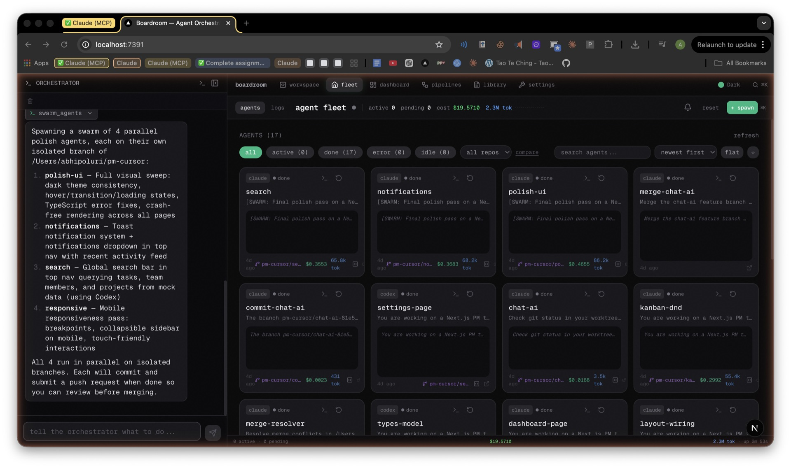
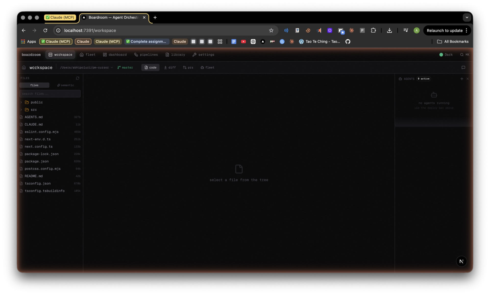
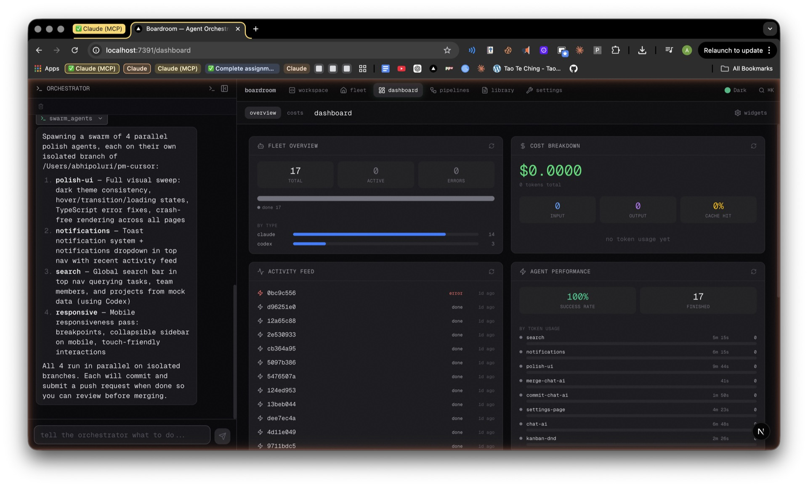
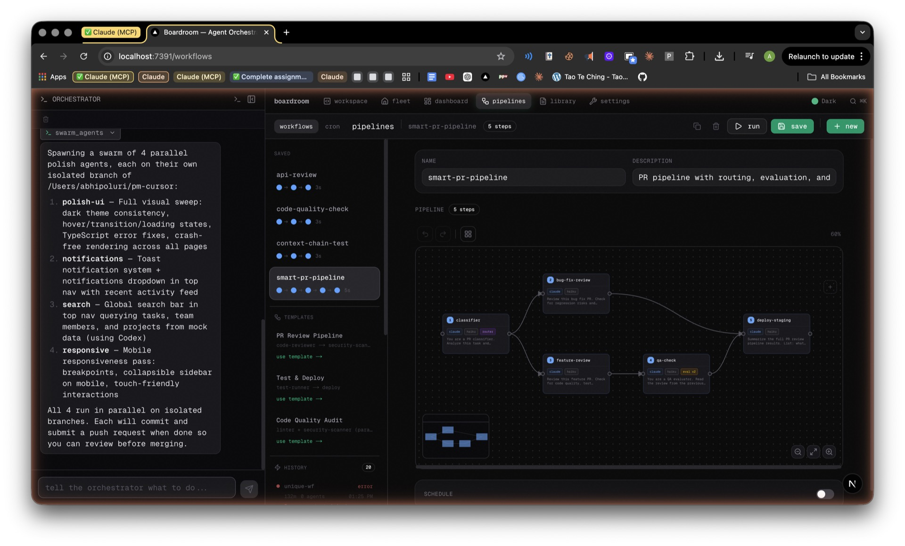
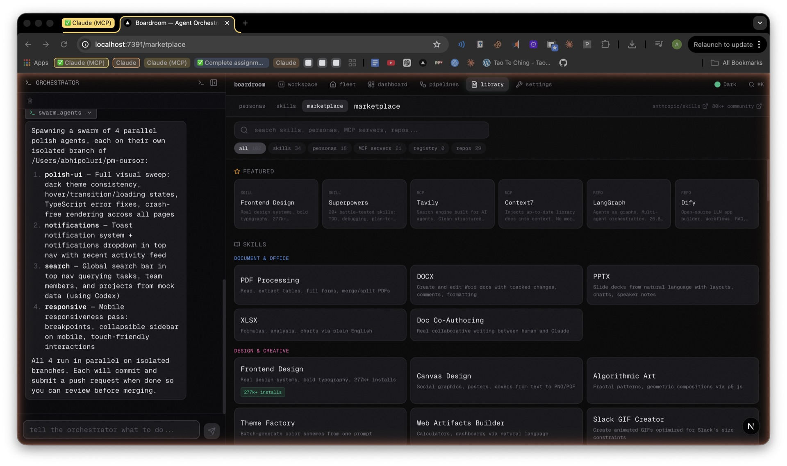

# boardroom
### AI Agent Orchestration Platform


Spawn, orchestrate, and manage AI agents from a single platform. Claude Code, Codex, OpenCode — running in parallel, coordinating, and delivering results.

[](https://youtu.be/iCSWPj-Qyss)

---

## Screenshots

### Fleet View

*Monitor every agent's status, cost, and output in real-time. Orchestrator chat sidebar on the left.*

### Workspace

*Full IDE workspace with file browser, code editor, and agents panel.*

### Dashboard

*Dashboard with fleet overview, cost breakdown, activity feed, and performance metrics.*

### Pipelines

*Visual DAG pipeline builder with saved workflows, templates, and run history.*

### Marketplace

*Browse 100+ skills, MCP servers, and agent personas. Search, preview, install.*

---

## Key Features

- **Multi-Agent Spawning** — Launch Claude Code, Codex, OpenCode, and custom shell agents in parallel across multiple repos
- **Orchestrator Chat** — Describe what you need in plain language; the orchestrator breaks it down and delegates
- **Visual DAG Pipelines** — Drag-and-drop workflow builder with output passing, evaluator loops, and router nodes
- **Git Worktree Isolation** — Every agent gets its own branch via git worktrees — no conflicts, clean separation
- **Auto-Commit & Auto-PR** — Agents commit their work and open pull requests automatically when done
- **Merge Conflict Resolution** — Boardroom detects conflicts and auto-spawns resolver agents to fix them
- **IDE Workspace** — In-browser file browser, multi-tab editor, syntax highlighting, diff viewer, and PR review
- **Fleet Monitoring** — Real-time agent status, live logs, cost tracking, and token usage per agent
- **Marketplace** — 100+ skills, MCP server configs, and reusable agent personas
- **Cron Scheduling** — Schedule recurring agent tasks on any cron expression
- **Agent Communication** — Built-in message bus so agents can coordinate and pass results to each other
- **Cost Analytics** — Per-agent token tracking and cost breakdown with optimization suggestions

---

## How It Works

1. **Describe** — Tell the orchestrator what you want to build in plain language
2. **Orchestrate** — Boardroom spawns agents, assigns tasks, and routes output between them
3. **Deliver** — Agents commit code, open PRs, and report back — you review and merge

---

## Quick Start

**Prerequisites:** Node.js 20+, Git, Claude Code CLI

```bash
# Install Claude Code CLI
npm install -g @anthropic-ai/claude-code && claude login

# Clone and run
git clone https://github.com/AbhiPoluri/boardroom
cd boardroom
npm install
npm run dev
```

Open [http://localhost:7391](http://localhost:7391)

**Optional agent types:**
- Codex: `npm install -g @openai/codex`
- OpenCode: [opencode.ai](https://opencode.ai)

**Docker:**
```bash
docker compose up

# Production (with API key)
BOARDROOM_API_KEY=$(openssl rand -hex 32) docker compose up -d
```

The Docker setup mounts `~/.config/claude` so agents use your existing Claude Code login inside the container.

---

## Architecture

Boardroom is a self-hosted Next.js app that manages agent processes directly on your machine.

- **Next.js 16 App Router + TypeScript** — full-stack framework for UI and API routes
- **SQLite (better-sqlite3)** — lightweight persistence for agents, workflows, logs, and costs
- **node-pty** — spawns real terminal sessions for each agent with live I/O streaming
- **Git worktrees** — branch isolation so parallel agents never conflict
- **SSE (Server-Sent Events)** — real-time streaming of agent output to the browser

```
boardroom/
├── app/
│   ├── workspace/        # IDE: file browser, editor, diff, PR review
│   ├── workflows/        # Visual DAG pipeline builder + runner
│   ├── orchestrator/     # Chat UI for orchestration
│   ├── costs/            # Token usage + cost analytics
│   ├── cron/             # Scheduled agent jobs
│   ├── skills/           # Skills and personas manager
│   └── api/              # 20+ REST API endpoints
├── components/           # Shared React components
├── lib/
│   ├── orchestrator.ts   # Claude CLI orchestration logic
│   ├── spawner.ts        # Agent process lifecycle
│   ├── workflow-runner.ts # DAG execution engine
│   ├── db.ts             # SQLite access layer
│   └── worktree.ts       # Git worktree operations
└── middleware.ts          # API key authentication
```

---

## Configuration

| Variable | Default | Description |
|----------|---------|-------------|
| `BOARDROOM_API_KEY` | _(none)_ | API authentication — set this in production |
| `BOARDROOM_RATE_LIMIT` | `10` | Max requests per minute per client |
| `BOARDROOM_MAX_AGENTS` | `20` | Max concurrent agents |
| `WORKFLOW_SANDBOX_REPO` | `~/boardroom-sandbox` | Default repo for workflow agent execution |
| `DB_PATH` | `.boardroom.db` | SQLite database file location |
| `PORT` | `3000` | Server port (dev uses 7391) |

No `ANTHROPIC_API_KEY` needed — agents authenticate via your Claude Code CLI login.

---

## API

Full interactive docs at [http://localhost:7391/api-docs](http://localhost:7391/api-docs).

| Method | Endpoint | Description |
|--------|----------|-------------|
| `POST` | `/api/agents` | Spawn a new agent |
| `GET` | `/api/agents` | List all agents and status |
| `DELETE` | `/api/agents/:id` | Stop and remove an agent |
| `POST` | `/api/workflows/run` | Execute a workflow pipeline |
| `GET` | `/api/costs` | Token usage and cost breakdown |
| `POST` | `/api/orchestrator/chat` | Send a message to the orchestrator |
| `GET` | `/api/logs/:agentId` | Stream live agent logs via SSE |

---

## Testing

```bash
npm test
npm run test:coverage
```

145 tests covering agent lifecycle, workflow execution, API endpoints, and git operations.

---

## Contributing

1. Fork the repo
2. Create a feature branch: `git checkout -b feature/your-feature`
3. Make your changes with tests
4. Open a pull request against `main`

Keep PRs focused — one feature or fix per PR. For large changes, open an issue first.

---

## License

MIT — see [LICENSE](./LICENSE)
