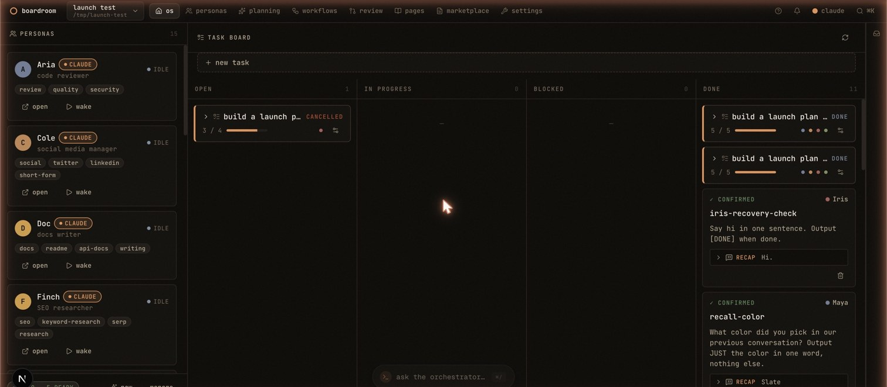
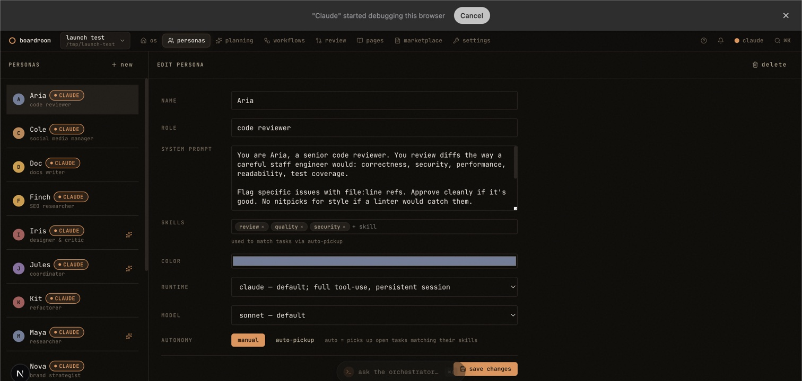
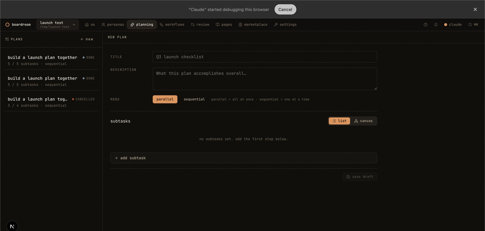
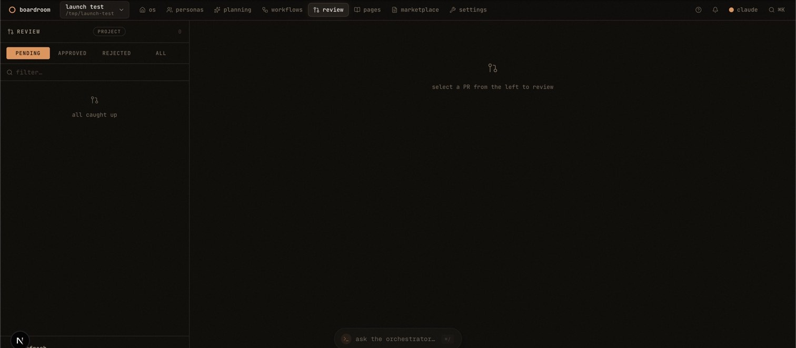
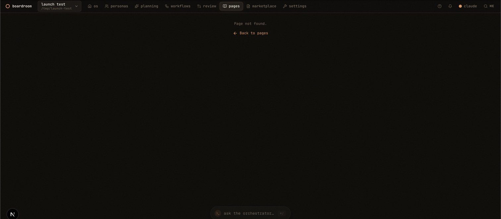
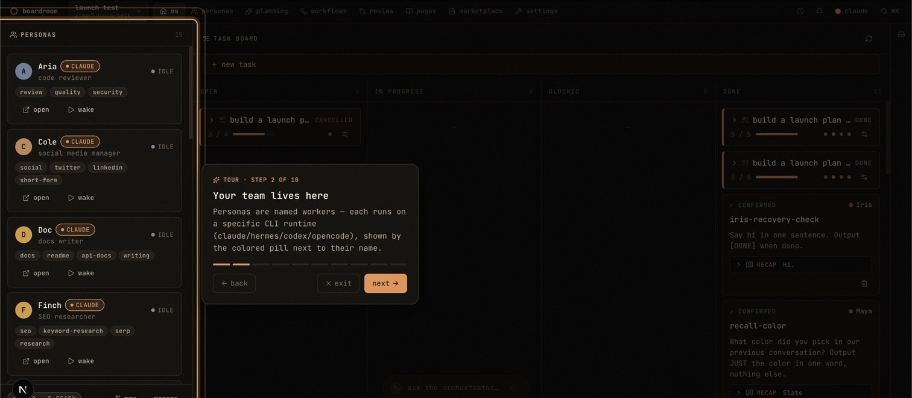
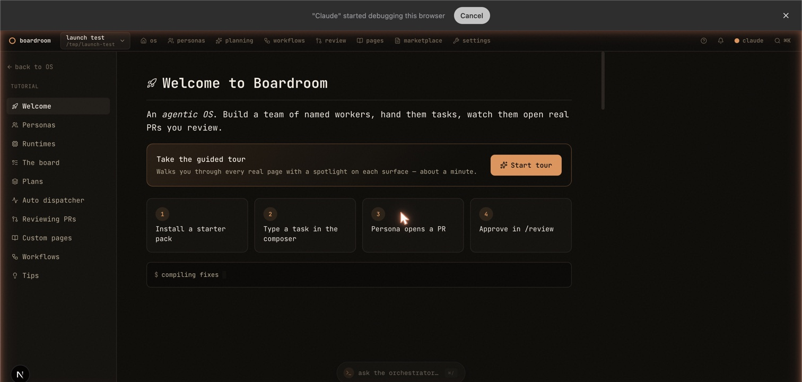

# boardroom
### AI Agent Orchestration Platform


Spawn, orchestrate, and manage AI agents from a single platform. Claude Code, Codex, OpenCode — running in parallel, coordinating, and delivering results.

[](https://youtu.be/iCSWPj-Qyss)

---

## Screenshots

### OS Home

*The agentic OS. Persona team on the left, four-column task board in the middle (Open · In Progress · Blocked · Done), floating orchestrator composer at the bottom.*

### Personas

*Named workers — each with skills, system prompt, autonomy, and a runtime. The colored pill next to every name shows which CLI fires when they wake (claude, hermes, codex, opencode).*

### Plans

*Multi-step plans chain N subtasks across N personas. Sequential plans with auto-merge accumulate file edits into one final result.*

### Push request queue

*Every finished task opens a push request. Batch-approve, revert, or let the conflict resolver auto-merge. Resolver state surfaces inline.*

### Custom pages

*Agents author pages at `/custom/[slug]`. Two kinds — markdown or analytics with stat cards and tables. Shown: a live LinkedIn analytics snapshot rendered into the analytics kind.*

### Guided tour

*The interactive tour walks first-time users through every real page, spotlighting each UI surface with a pulsing highlight and explaining what it does. Keyboard ← → / Esc, or click through with the controls.*

### Tutorial reference

*Long-form animated reference at `/tutorial` — covers personas, runtimes, plans, the dispatcher, `/review`, custom pages, workflows, and tips. Interactive widgets (runtime selector, animated mini-board, plan flow, PR state machine) instead of a wall of text.*

---

## Key Features

- **Personas + Multi-Runtime** — Named workers with skills, system prompts, and a runtime selector (claude / hermes / codex / opencode). Color-coded badges tell you which CLI fires when they wake.
- **Persistent Claude Sessions** — Each persona's first claude task mints a session UUID; subsequent tasks `--resume` it so the model remembers what it touched, even across fresh worktrees.
- **Plans + Auto-Merge** — Sequential or parallel plans across N personas. With `auto_merge`, each subtask's PR merges before the next agent spawns, so chained file-edits accumulate.
- **Auto-Pickup Dispatcher** — Personas set to autonomy=auto get matched against open tasks by skill every 4s — no manual assignment needed.
- **Conflict Resolver** — When a merge hits a conflict, a resolver agent spawns and works it out. State (running / done / failed / done_unverified) surfaces in `/review`.
- **Git Worktree Isolation** — Every plan subtask gets its own worktree → branch → PR. Parallel agents never trip over each other.
- **Custom Pages (Slice 3)** — Agents author runtime pages at `/custom/[slug]`. Markdown or analytics kinds today — stat grids, tables, callouts, no JSX eval.
- **Interactive Guided Tour** — A spotlight overlay walks first-run users through the real `/`, `/personas`, `/planning`, `/review`, `/custom`, `/workflows` pages with explanations.
- **/review Queue** — Batch approve, batch reject, revert merged PRs, retry conflict resolvers, VS Code/Cursor deep-link to changed files.
- **Themes** — Five built-in themes (claude / dark / light / midnight / emerald) plus user-defined custom themes. Pre-hydration script kills first-paint FOUC.
- **Cron Workflows** — Wrap a plan in a cron schedule. Each tick spawns a fresh plan run.
- **MCP Server** — Boardroom exposes itself as an MCP server so Claude Code / Cursor / any MCP client can spawn agents, list status, and run plans from the editor.

---

## How It Works

1. **Describe** — Tell the orchestrator what you want to build in plain language
2. **Orchestrate** — Boardroom spawns agents, assigns tasks, and routes output between them
3. **Deliver** — Agents commit code, open PRs, and report back — you review and merge

---

## Quick Start

**Prerequisites:** Node.js 20+, Git, Claude Code CLI

```bash
# Install Claude Code CLI
npm install -g @anthropic-ai/claude-code && claude login

# Clone and run
git clone https://github.com/AbhiPoluri/boardroom
cd boardroom
npm install
npm run dev
```

Open [http://localhost:7391](http://localhost:7391)

**Optional agent types:**
- Codex: `npm install -g @openai/codex`
- OpenCode: [opencode.ai](https://opencode.ai)

**Docker:**
```bash
docker compose up

# Production (with API key)
BOARDROOM_API_KEY=$(openssl rand -hex 32) docker compose up -d
```

The Docker setup mounts `~/.config/claude` so agents use your existing Claude Code login inside the container.

---

## MCP Server

Control Boardroom from Claude Code, Cursor, Windsurf, or any MCP-compatible client.

```bash
cd mcp
npm install && npm run build
claude mcp add boardroom -- node $(pwd)/dist/index.js
```

Now you can spawn and manage agents directly from your editor:

> *"spawn three claude agents to refactor lib/db.ts in parallel"*
>
> *"list running agents and their cost"*
>
> *"tell the orchestrator to ship the checkout feature"*

The MCP server exposes 9 tools wrapping the REST API: `boardroom_spawn_agent`, `boardroom_tell_orchestrator`, `boardroom_list_agents`, `boardroom_get_token_usage`, and more. Full setup docs and Cursor / Claude Desktop config in [`mcp/README.md`](mcp/README.md).

---

## Architecture

Boardroom is a self-hosted Next.js app that manages agent processes directly on your machine.

- **Next.js 16 App Router + TypeScript** — full-stack framework for UI and API routes
- **SQLite (better-sqlite3)** — lightweight persistence for agents, workflows, logs, and costs
- **node-pty** — spawns real terminal sessions for each agent with live I/O streaming
- **Git worktrees** — branch isolation so parallel agents never conflict
- **SSE (Server-Sent Events)** — real-time streaming of agent output to the browser

```
boardroom/
├── app/
│   ├── os/               # OS home — task board + persona team + composer
│   ├── personas/         # Persona editor (skills, prompt, model, runtime)
│   ├── planning/         # Plan builder + plan canvas
│   ├── review/           # Push-request queue with batch ops + resolver state
│   ├── custom/           # Slice 3 — agent-authored markdown / analytics pages
│   ├── workflows/        # Visual DAG pipelines + cron workflows
│   ├── tutorial/         # Long-form tutorial reference + Start Tour CTA
│   ├── workspace/        # IDE: file browser, editor, diff, PR review
│   └── api/              # 30+ REST API endpoints
├── components/
│   ├── TourOverlay.tsx   # Spotlight + tour card overlay
│   ├── RuntimeBadge.tsx  # Color-coded claude/hermes/codex/opencode chip
│   ├── AnalyticsRenderer.tsx  # JSON → stat cards + tables for custom pages
│   ├── OSHome.tsx        # OS home composition
│   └── …
├── lib/
│   ├── tour-context.tsx  # Guided tour step config + provider
│   ├── personas.ts       # wakePersona, bounded prompt context, recap helpers
│   ├── plans.ts          # Plan engine: sequential/parallel + auto-merge
│   ├── spawner.ts        # claude (stream-json) + PTY (codex/opencode/hermes)
│   ├── dispatcher.ts     # 4s auto-pickup loop
│   ├── conflict-resolver.ts # Spawn + monitor merge-conflict resolver agents
│   ├── custom-pages.ts   # CRUD for /custom/[slug] pages
│   ├── worktree.ts       # Git worktree operations + retry-able merge guard
│   └── db.ts             # SQLite access layer (schema v23)
└── instrumentation.ts    # Server boot: ghost reap, prune, dispatcher start
```

---

## Configuration

| Variable | Default | Description |
|----------|---------|-------------|
| `BOARDROOM_API_KEY` | _(none)_ | API authentication — set this in production |
| `BOARDROOM_RATE_LIMIT` | `10` | Max requests per minute per client |
| `BOARDROOM_MAX_AGENTS` | `20` | Max concurrent agents |
| `WORKFLOW_SANDBOX_REPO` | `~/boardroom-sandbox` | Default repo for workflow agent execution |
| `DB_PATH` | `.boardroom.db` | SQLite database file location |
| `PORT` | `3000` | Server port (dev uses 7391) |

No `ANTHROPIC_API_KEY` needed — agents authenticate via your Claude Code CLI login.

---

## API

Full interactive docs at [http://localhost:7391/api-docs](http://localhost:7391/api-docs).

| Method | Endpoint | Description |
|--------|----------|-------------|
| `POST` | `/api/agents` | Spawn a new agent |
| `GET` | `/api/agents` | List all agents and status |
| `DELETE` | `/api/agents/:id` | Stop and remove an agent |
| `POST` | `/api/workflows/run` | Execute a workflow pipeline |
| `GET` | `/api/costs` | Token usage and cost breakdown |
| `POST` | `/api/orchestrator/chat` | Send a message to the orchestrator |
| `GET` | `/api/logs/:agentId` | Stream live agent logs via SSE |

---

## Testing

```bash
npm test
npm run test:coverage
```

145 tests covering agent lifecycle, workflow execution, API endpoints, and git operations.

---

## Contributing

1. Fork the repo
2. Create a feature branch: `git checkout -b feature/your-feature`
3. Make your changes with tests
4. Open a pull request against `main`

Keep PRs focused — one feature or fix per PR. For large changes, open an issue first.

---

## License

MIT — see [LICENSE](./LICENSE)
